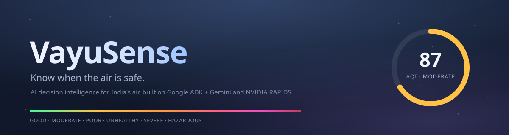
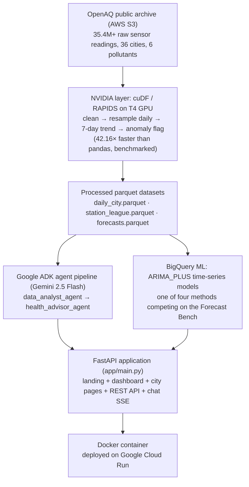
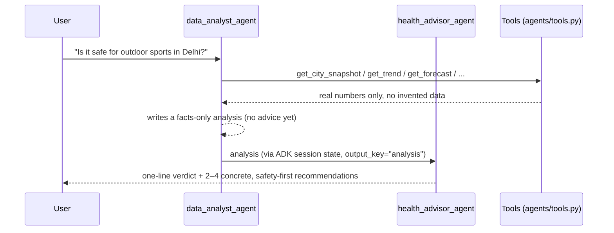

<div align="center">



### AI decision intelligence for the air 36 Indian cities breathe, right now.

[](https://vayusense-663068003180.us-central1.run.app)
[](https://vayusense-663068003180.us-central1.run.app)
[](#-testing)

[](https://www.python.org/)
[](https://fastapi.tiangolo.com/)
[](https://google.github.io/adk-docs/)
[](https://ai.google.dev/)
[](https://cloud.google.com/bigquery-ml/docs)
[](https://rapids.ai/)
[](deploy/Dockerfile)

**Team BloodWyrm (solo) · Anshul Jain · IIIT Delhi**
Gen AI Academy APAC 2026, Cohort 2: *"AI for Better Living and Smarter Communities"*

</div>

---

## 📖 Table of contents

- [The problem](#-the-problem)
- [What VayuSense actually does](#-what-vayusense-actually-does)
- [Tour: every page, every feature](#-tour-every-page-every-feature)
  - [Landing page](#1-landing-page-)
  - [Live dashboard](#2-live-dashboard-dashboard)
  - [City instrument panel](#3-city-instrument-panel-cityslug)
  - [Ask VayuSense](#4-ask-vayusense-the-multi-agent-chat)
- [Architecture](#-architecture)
- [Multi-agent design (Google ADK + Gemini)](#-multi-agent-design-google-adk--gemini)
- [The Forecast Bench](#-the-forecast-bench)
- [Human impact methodology](#-human-impact-methodology)
- [Why GPU acceleration matters here](#-why-gpu-acceleration-matters-here)
- [The immersive design system](#-the-immersive-design-system)
- [Technology stack](#-technology-stack)
- [Repository layout](#-repository-layout)
- [API reference](#-api-reference)
- [Testing](#-testing)
- [Running locally](#-running-locally)
- [Deployment](#-deployment)
- [Roadmap](#-roadmap)
- [Credits](#-credits)

---

## 🌫️ The problem

Delhi NCR, and most of urban India, breathes some of the most dangerous air of any populated region on Earth. Parents, schools, clinics, and city officials all make daily decisions that depend on air quality: *should sports practice happen outdoors today, should a clinic stock extra nebulizers this week, which ward needs a public advisory.*

The raw data to answer these questions already exists in public sensor networks, but it's fragmented across stations, buried in raw CSVs, and unreadable to anyone who isn't a data analyst.

**VayuSense closes that gap.** It takes tens of millions of raw sensor readings, processes them at GPU speed, reasons over them with a grounded two-agent AI pipeline, and turns all of it into one direct, human answer to the question *"is it safe right now?"*, wrapped in an interface designed to feel like a living instrument, not a spreadsheet.

## 🎯 What VayuSense actually does

| | |
|---|---|
| 🗺️ **36 cities, live** | Every major Indian state except Goa (verified zero OpenAQ stations there before deciding not to fake a data point), 6 pollutants each, ranked nationally every request |
| 🩺 **Health guidance, instantly** | Six-condition, six-category rule-based guidance table: zero LLM latency, because a parent asking "is it safe for my child" shouldn't wait on a model |
| 🤖 **A grounded AI analyst + advisor** | Ask a plain-language question, get a numbers-first analysis and a safety-first recommendation, never a hallucinated statistic |
| 📈 **Forecasts that compete in public** | Four forecasting methods, backtested identically, and the app serves whichever one actually wins for each city/pollutant series |
| 🚬 **Human impact, not just AQI** | Cigarette-equivalent exposure and estimated life-expectancy impact: numbers a non-expert actually feels |
| 🌬️ **Real weather woven in** | Wind direction/speed, temperature, humidity, and UV per city, and the *ambient visuals themselves* respond to that live weather |
| 🚨 **Early-warning system** | Category breaches, WHO-guideline exceedances, and statistically detected anomalies surfaced across all 36 cities, worst-first |
| 👁️ **Multimodal sky check** | Upload a photo of the sky; Gemini vision reads it against the city's *actual measured* AQI as a complement, never a substitute |
| ⚡ **GPU-accelerated pipeline** | NVIDIA cuDF/RAPIDS turns a 10.4M-row daily pipeline into a **42×** speedup over pandas, proven, reproducible, on-record |

---

## 🖼️ Tour: every page, every feature

VayuSense is one FastAPI app serving three distinct experiences, all sharing the same severity-driven visual language (see [the design system](#-the-immersive-design-system) below).

### 1. Landing page (`/`)

```
┌──────────────────────────────────────────────────────────────────┐
│  VayuSense        Why   How it works   GPU benchmark   [Dashboard]│
├──────────────────────────────────────────────────────────────────┤
│                                                                    │
│                    VAYUSENSE                                      │
│         ● GPU-accelerated · Multi-agent AI · 35.4M readings        │
│                                                                    │
│              Know when the air is safe.                           │
│     Every breath in Delhi carries a cost most dashboards          │
│           never show you. [See your city's air →]                 │
│                                                                    │
│   35.4M readings   42.16× faster   36 cities·6 pollutants   2 agents│
├──────────────────────────────────────────────────────────────────┤
│  WHAT'S ACTUALLY INSIDE: not a score, a whole instrument panel    │
│  [Live trends] [Health guidance] [Forecast bench] [Human impact]  │
├──────────────────────────────────────────────────────────────────┤
│  PICK A CITY: worst-AQI-8 cities shown, "+28 more" → search/dash  │
├──────────────────────────────────────────────────────────────────┤
│  THE REAL NUMBER: cigarette-equivalent exposure, life expectancy  │
│  GPU BENCHMARK: 42.16× cuDF vs pandas, live from /api/benchmark   │
└──────────────────────────────────────────────────────────────────┘
```

- A **live, worst-AQI-8 city grid** (not all 36, that's the dashboard's job), each tile bordered in its own severity color, plus a "+28 more cities tracked live" line with **Search a city** and **Open Live Dashboard** actions
- A **cursor-reactive aurora + haze particle field** in the background, tinted and sped up by the *worst active alert's* severity, with a search bar that jumps straight to any of the 36 cities
- A **GPU benchmark showcase**, pulling the live, current benchmark numbers straight from `/api/benchmark`, never a stale, hardcoded figure
- The archive-reading counter, speedup multiplier, and city/pollutant counts are all **real, live API values**, not marketing copy

### 2. Live dashboard (`/dashboard`)

```
┌──────────────────────────────────────────────────────────────────┐
│  VayuSense                                    [Search a city...] │
├──────────────────────────────────────────────────────────────────┤
│ RIGHT NOW               ● Overview  (chapter rail, desktop only) │
│ What does today's air actually cost you?           ○ Alerts     │
│                                                     ○ Compare    │
│  ╭──────────╮  MODERATE                            ○ Year/Year  │
│  │   87     │  #6 of 36 · Worst right now          ○ Live map   │
│  │ AQI EPA  │  Driven by PM2.5                                  │
│  ╰──────────╯  29°C · 78% · 23km/h · UV3                        │
│                HUMAN IMPACT: 3.9/day cigs · 7.8yrs impact         │
├──────────────────────────────────────────────────────────────────┤
│ EARLY WARNING: active alerts, worst-first, "Generate advisory"    │
├──────────────────────────────────────────────────────────────────┤
│ COMPARE: the full, honest 36-city leaderboard                    │
├──────────────────────────────────────────────────────────────────┤
│ YEAR OVER YEAR: trailing 7-day AQI vs same week last year         │
├──────────────────────────────────────────────────────────────────┤
│ LIVE: real wind vectors (Open-Meteo) + AQI heatmap (Leaflet)      │
└──────────────────────────────────────────────────────────────────┘
```

- The hero snapshot always shows the **actual worst city nationally, right now**, not a fixed default, with an explicit **"Worst right now"** badge so it reads as intentional
- A **live wind + AQI heatmap** built on Leaflet + `leaflet-velocity`, sampling real wind vectors across India and overlaying a red-to-green AQI heatmap on `geoBoundaries` state outlines
- The full, unfiltered **36-city ranking table** (correctly *not* curated here, since this is the command-center view)
- A **desktop chapter rail** (five stops: Overview → Alerts → Compare → Year/Year → Live map) that tracks scroll position, plus a **mobile chapter pill** carrying the same orientation on narrow viewports where the rail has no room

### 3. City instrument panel (`/city/<slug>`)

```
┌──────────────────────────────────────────────────────────────────┐
│ ← Dashboard   Overview Alerts Compare Hotspots Pollutants Health   │
│               Solutions Advisory Vision Calendar Trends Ask       │
├──────────────────────────────────────────────────────────────────┤
│  ╭──────────╮  MODERATE  #6 of 36                    ● Overview  │
│  │   87     │  Driven by PM2.5 · see full ranking ↓   ○ Alerts   │
│  │ AQI EPA  │  updated 2026-07-29                      ○ Compare │
│  ╰──────────╯  29°C · 78% · 23km/h · UV3               ○ Hotspots│
│  HUMAN IMPACT: 3.9 cigs/day · 7.8yr impact              ⋮ (12 stops)│
├──────────────────────────────────────────────────────────────────┤
│ EARLY WARNING: alerts for this city, with generated advisories    │
│ COMPARE: rank-centered window (neighbors, not the national top-5) │
│ HOTSPOTS: worst monitoring stations by average PM2.5              │
│ POLLUTANTS: 6 sub-AQI cards, click one → retargets the trend chart│
│ HEALTH: 6 condition tabs, instant rule-based guidance, no LLM      │
│ SOLUTIONS: air purifier / car filter / N95 / stay-indoor, by AQI   │
│ ADVISORY: auto-generated public advisory text                     │
│ VISION: upload a sky photo, Gemini reads it against real AQI       │
│ CALENDAR: every archived day, colored by AQI band, all years       │
│ TRENDS: monthly/annual averages, most/least-polluted callouts      │
│ FORECAST: 90-day chart, 7-day rolling mean, bench-winning forecast │
│ ASK: the multi-agent chat, scoped to this city                    │
└──────────────────────────────────────────────────────────────────┘
```

Every one of those twelve sections is a real rail stop: the chapter rail expands to match the nav exactly, filtering out the Forecast Bench stop automatically on cities where that section has no data to show yet.

Extra touches unique to this page:
- **Rank-centered ranking window**: the Compare section shows five cities *centered on this city's actual national rank*, comparable neighbors, not an unrelated national top-5, with "Show all 36 cities" one click away
- **Smooth city-switch transition**: picking a new city (search or dropdown) dips and restores the whole hero once, marking an actual place change; a mere pollutant-dropdown switch never triggers it
- A **live data pulse**: the AQI ring and every KPI card briefly glow in the current severity color the moment fresh data actually lands, on load and on every city switch
- A **shareable OG card**: `/city/<slug>/card.png` renders a branded PNG with the city's AQI, category, and human-impact numbers baked in, for link previews

### 4. Ask VayuSense (the multi-agent chat)

Embedded at the bottom of every city page (and reachable app-wide), with a **Live Reasoning Trace**: as the data-analyst agent actually calls its tools, a chip appears in real time for each one (`get_city_snapshot`, `get_trend`, `get_forecast`, and so on) before the health-advisor's answer streams in. No fabricated timing: it renders exactly what the SSE stream sends, as it happens.

```
┌──────────────────────────────────────────────────────────────────┐
│ ASK VAYUSENSE   ADK MULTI-AGENT   ANALYST → ADVISOR    [New chat] │
├──────────────────────────────────────────────────────────────────┤
│ Namaste! I analyze millions of readings before I answer.          │
│                                                                    │
│ [Is it safe for outdoor sports?] [Compare Delhi vs Mumbai]         │
│ [Which are the worst hotspots?]                                   │
│                                                                    │
│  ⚙ get_city_snapshot  ⚙ get_trend  ⚙ get_forecast   ← live chips  │
│  "Delhi's PM2.5 is 6.2× the WHO 24-hour limit today, trending..." │
├──────────────────────────────────────────────────────────────────┤
│ [Ask about air quality, health risk, timing...]         [Ask →]  │
└──────────────────────────────────────────────────────────────────┘
```

---

## 🏗️ Architecture



## 🤝 Multi-agent design (Google ADK + Gemini)

VayuSense uses a **sequential two-agent pipeline** (`agents/agent.py`) that mirrors a human analyst-then-advisor workflow:



1. **`data_analyst_agent`** gathers facts before saying anything, using eight tools: `get_city_snapshot`, `get_trend`, `get_worst_stations`, `get_human_impact`, `get_forecast`, `get_year_over_year`, `list_cities`, and `get_active_alerts_tool`. It compares pollutant levels to WHO 24-hour guidelines as a multiple ("6.2× the WHO limit"), reports the 7-day trend, anomaly days, hotspots, year-over-year change, and a hedged forecast, and is explicitly instructed **not** to give advice, only facts.
2. **`health_advisor_agent`** receives that report through ADK session state and turns it into a one-line verdict plus 2–4 concrete recommendations (timing, N95 masks, indoor alternatives, extra caution for children/elderly/respiratory-or-heart conditions), while staying strictly grounded in the analyst's numbers. It can also call `retrieve_guidelines(query)` to pull a real, citable passage (WHO's health-based guideline, India's CPCB NAAQS standard) when explaining *why* a threshold is what it is, reserved for questions where a cited source adds something the raw numbers don't, not routine "is it safe today" checks.

This facts-first, advice-second separation keeps every recommendation auditable and sharply reduces the risk of an LLM inventing a statistic.

Each browser session keeps a stable `session_id` shared by both agents across turns, so follow-ups like *"what about Mumbai?"* or *"and tomorrow?"* resolve against the most recently discussed city/pollutant/timeframe, no need to repeat context. A **New chat** control lets a user deliberately start fresh.

## 🔮 The Forecast Bench

Most projects bolt on an ML forecast; VayuSense makes its forecasters **compete in public**, across all **216 series** (36 cities × 6 pollutants):

| # | Method | How it works | Series won |
|---|---|---|---|
| 1 | **Naive persistence** | Tomorrow equals today: the baseline every honest evaluation needs | **104** |
| 2 | **Damped trend** | Holt's damped-trend (φ=0.85) on the 7-day rolling average, clamped to historical range | 34 |
| 3 | **Gradient boosting** | scikit-learn `HistGradientBoosting` on lag/rolling-mean/seasonality features | 32 |
| 4 | **BigQuery ML ARIMA_PLUS** | SQL-trained time-series models, one model covering all 216 series | 46 |

The three local methods are scored with an identical rolling-origin backtest (8 held-out 3-day windows); ARIMA_PLUS is scored on a single 24-day holdout and labeled as such. The app **serves whichever method actually won** for each series and cites it everywhere: the scoreboard (`/api/forecast_bench`), the trend chart's dotted projection legend, and the chat agent's own phrasing ("projected by [method]; historical error ±X µg/m³").

The honest result, naive persistence wins **nearly half** the series, is the point: daily air-quality data is genuinely hard to forecast, and the scoreboard says so instead of pretending otherwise. All training/backtesting runs offline (`ml/bench.py`, `ml/bq_arima.py`); the live app only reads precomputed artifacts, so there's no runtime BigQuery dependency or new failure mode at request time.

## 🚬 Human impact methodology

`get_human_impact` (`agents/tools.py`) converts a city's annual average PM2.5 into two metrics a non-expert actually feels:

- **Cigarette-equivalent exposure**: Berkeley Earth methodology: ~22 µg/m³ of sustained 24-hour PM2.5 ≈ smoking one cigarette
- **Estimated life-expectancy impact**: AQLI-style coefficient: ~0.98 years lost per additional 10 µg/m³ sustained above the WHO annual guideline of 5 µg/m³

Both are clearly labeled as illustrative, decision-support estimates, never a medical or actuarial diagnosis.

## ⚡ Why GPU acceleration matters here

The live archive spans **35,404,493** real sensor readings across 36 cities and 6 pollutants, every Indian state except Goa. Turning that into a usable daily snapshot means cleaning, resampling to daily means, computing 7-day rolling trends, and flagging anomaly days, over **10,443,350** rows in the benchmarked pipeline.

<div align="center">

| | pandas (CPU) | NVIDIA cuDF/RAPIDS (T4 GPU) | Speedup |
|---|:---:|:---:|:---:|
| **Pipeline time** | 7.994s | 0.19s | **42.16×** |

</div>

This isn't a cosmetic optimization: it's the difference between a nightly batch report and a dashboard that refreshes per city, per pollutant, the moment someone actually needs an answer. The benchmark notebook and raw output live in `benchmark/vayusense_gpu_benchmark.ipynb` / `benchmark/benchmark_results.json`, and the same numbers are served live at [`/api/benchmark`](https://vayusense-663068003180.us-central1.run.app/api/benchmark), never hardcoded into the UI.

---

## 🎨 The immersive design system

Every screen shares one language: **the air's actual severity drives the interface itself**, not just the numbers on it. All of it is additive, degrades gracefully, and is fully suppressed under `prefers-reduced-motion: reduce`.

| Feature | What it does |
|---|---|
| 🌈 **Severity color ramp** | Six anchor colors (good → hazardous) computed once and reused everywhere: ring strokes, alert badges, rail dots, particle tint |
| 🌫️ **Living Atmosphere** | A soft background glow that tints toward the current city's severity color and deepens with scroll depth |
| 🫁 **Breathing Motion** | The logo and AQI ring pulse faster but *shallower* as air gets worse: labored breathing as a metaphor, not decoration |
| 🌆 **Smog Vignette** | Screen edges darken with severity: visibility itself as the metaphor, distinct from color or motion |
| 🧭 **Scroll-driven storytelling** | A chapter rail tracks scroll position through every section (12 stops on the city page, 5 on the dashboard), with header parallax and a scroll-linked atmosphere boost; a mobile chapter pill carries the same orientation below 900px where the rail has no room |
| 💓 **Live data pulse** | The AQI ring and stat cards glow once, in the current severity color, the instant fresh data actually lands |
| 🔄 **Smooth city-switch transition** | The whole hero dips and restores on an actual city change, never on a mere pollutant switch |
| 🌬️ **Wind-driven particles** | Background haze particles drift with the *real* reported wind direction and speed for the current city, not just a generic animation |
| 🌗 **Day/night ambient density** | Particle density/brightness follows real IST time-of-day, recomputed every 5 minutes |
| 🚨 **Early-warning alerts** | Category breaches, WHO exceedances, and z-score anomalies computed across all 36 cities and surfaced worst-first, with one-click AI-generated advisories |
| 🎯 **Rank-centered ranking window** | The per-city Compare section centers on *that city's* actual rank: comparable neighbors, not an arbitrary top-5 |
| 🗺️ **Curated landing grid** | The landing page shows the real worst-8 cities right now, not all 36 (that's the dashboard's job), with a clear path to "see all" |
| 💬 **Live Reasoning Trace** | Ask VayuSense's tool calls render as they actually happen, not batched after the fact |

Every one of these was built from a real, measured signal (AQI, wind, time, rank, scroll position); nothing here is animation for its own sake.

---

## 🧰 Technology stack

<table>
<tr><td valign="top">

**Google Cloud**
- Gemini 2.5 Flash: both agents
- Google ADK: sequential multi-agent orchestration + session memory
- BigQuery ML: ARIMA_PLUS forecasting
- Cloud Run: production deployment (Vertex AI mode, real Cloud Billing quota)

</td><td valign="top">

**NVIDIA**
- cuDF / RAPIDS: GPU dataframe processing
- T4 GPU (Google Colab): benchmark + processing hardware

</td><td valign="top">

**ML bench (offline)**
- scikit-learn `HistGradientBoosting`
- Rolling-origin backtesting, identical folds per method

</td></tr>
<tr><td valign="top">

**Application layer**
- FastAPI: backend API + server-rendered pages
- Jinja2 + vanilla JS + Plotly-style charts: no heavy frontend framework
- Space Grotesk (headlines/numerals) + IBM Plex Sans (body)
- pandas + PyArrow: local data access
- httpx: request-time OpenAQ live layer, TTL-cached
- Pillow: server-rendered OG share cards
- Docker: containerized deployment

</td><td valign="top">

**Live context**
- Open-Meteo: real-time weather + wind per city
- Leaflet + `leaflet-velocity` + `leaflet-heat`: the dashboard's live wind/AQI map
- geoBoundaries: state outline data (CC BY 2.5 India)

</td><td valign="top">

**Data source**
- [OpenAQ](https://openaq.org): global, public, open air-quality archive, accessed via its AWS Open Data S3 bucket

</td></tr>
</table>

## 📁 Repository layout

```
ingest/           OpenAQ archive discovery and bulk download scripts
benchmark/        cuDF vs pandas GPU benchmark notebook, results, forecast bench
agents/           ADK agent definitions (analyst, advisor), tools, alerts, vision
app/              FastAPI application: routes, Jinja2 templates, static assets
data/             Raw and GPU-processed datasets (parquet)
deploy/           Dockerfile and deployment configuration
docs/             Pitch deck, architecture diagrams, design specs, README assets
ml/               Forecast training, backtesting, BigQuery ML integration
tests/            112 tests across 26 files, pytest
render.yaml       One-click Render deployment blueprint (alternate path)
```

<details>
<summary><b>📂 Expand full tree</b></summary>

```
vayusense/
├── agents/
│   ├── agent.py          # ADK sequential pipeline definition
│   ├── tools.py           # data_analyst_agent's 8 tools
│   ├── alerts.py           # early-warning system (category/WHO/anomaly)
│   ├── aqi.py              # EPA-method AQI computation, category bands
│   ├── vision.py           # Gemini multimodal sky-photo assessment
│   └── ...
├── app/
│   ├── main.py             # FastAPI routes + REST API
│   ├── weather.py          # Open-Meteo current-weather fetcher
│   ├── wind.py             # live wind grid for the dashboard map
│   ├── card.py             # OG share-card PNG renderer
│   ├── data_sync.py        # cache invalidation on data refresh
│   └── templates/
│       ├── landing.html    # public landing page
│       ├── summary.html    # /dashboard
│       └── index.html      # /city/<slug> instrument panel
├── ml/
│   ├── bench.py            # local forecaster training + backtest
│   ├── backtest.py         # rolling-origin backtest harness
│   └── bq_arima.py         # BigQuery ML ARIMA_PLUS integration
├── ingest/                 # OpenAQ discovery + bulk download
├── benchmark/              # GPU benchmark notebook + recorded results
├── docs/
│   ├── deck/                # hackathon submission deck
│   ├── superpowers/specs/   # every feature's design spec, written before code
│   └── readme/              # README banner + assets
├── tests/                  # 112 tests, 26 files
├── deploy/Dockerfile
└── render.yaml
```

</details>

## 🔌 API reference

<details>
<summary><b>Pages</b></summary>

| Route | Method | Description |
|---|---|---|
| `/` | GET | Public landing page |
| `/dashboard` | GET | Main interactive dashboard |
| `/city/<slug>` | GET | Dedicated, shareable per-city instrument panel; URL and tab title stay in sync with in-page city switches |
| `/city/<slug>/card.png` | GET | Server-rendered OG share card (PNG) for that city |

</details>

<details>
<summary><b>Core data API</b></summary>

| Route | Method | Description |
|---|---|---|
| `/api/cities` | GET | List of all tracked cities |
| `/api/aqi?city=` | GET | EPA-method AQI (live-preferred, archive fallback), category, sub-AQIs, full national ranking |
| `/api/snapshot?city=` | GET | Latest pollutant levels, trend, WHO comparison, EPA AQI |
| `/api/calendar?city=&year=` | GET | Per-day AQI for every archived day of a year |
| `/api/monthly?city=` | GET | Monthly/annual averages, most/least-polluted months, YoY change |
| `/api/yoy?city=` / `/api/yoy_ranking` | GET | Trailing 7-day AQI vs the same week last year, per city and nationally |
| `/api/trend?city=&parameter=&days=` | GET | Daily + 7-day rolling series for one pollutant |
| `/api/stations?city=` | GET | Worst pollution hotspots by monitoring station |
| `/api/impact?city=` | GET | Cigarette-equivalent and life-expectancy impact estimates |
| `/api/alerts?city=` | GET | Early-warning alerts: category breaches, WHO exceedances, anomalies |
| `/api/export?city=&format=` | GET | Raw archive export, CSV or JSON |

</details>

<details>
<summary><b>Forecasting</b></summary>

| Route | Method | Description |
|---|---|---|
| `/api/forecast?city=&parameter=&days=` | GET | Short-term projection from the bench-winning method, with cited error |
| `/api/forecast_bench?city=&parameter=` | GET | Full backtest scoreboard across all four methods |
| `/api/benchmark` | GET | Recorded GPU-vs-CPU benchmark results (live-served, never hardcoded) |

</details>

<details>
<summary><b>Guidance, weather & live context</b></summary>

| Route | Method | Description |
|---|---|---|
| `/api/health_guidance` | GET | Full rule-based guidance table (6 conditions × 6 categories) |
| `/api/solutions?category=` | GET | Recommended protective actions for a given AQI category |
| `/api/advisory?city=` / `/api/advisory/all` | GET | Auto-generated public advisory text |
| `/api/weather?city=` | GET | Real-time temperature, humidity, wind speed/direction, UV |
| `/api/wind-grid` | GET | Live wind vector grid for the dashboard's map |
| `/api/city-coords` | GET | Lat/lon for every tracked city |

</details>

<details>
<summary><b>AI chat</b></summary>

| Route | Method | Description |
|---|---|---|
| `/api/ask` | POST | Ask a question, get the full analyst → advisor answer (non-streaming) |
| `/api/ask/stream` | POST | Same pipeline, streamed via SSE, powers the Live Reasoning Trace |
| `/api/vision-check?city=` | POST | Upload a sky photo, get a Gemini-vision read against the city's real AQI |

</details>

## ✅ Testing

**112 tests across 26 files**, covering the AQI computation, the agent tools, forecast serving and backtesting, alerts, live-data overlay logic, calendar/monthly/YoY endpoints, health guidance, solutions, weather, wind, and share-card rendering.

```bash
pytest -q
# 112 passed
```

## 🚀 Running locally

```bash
python -m venv .venv
source .venv/bin/activate
pip install -r requirements.txt

# Create a .env file with:
#   GOOGLE_GENAI_USE_VERTEXAI=FALSE
#   GOOGLE_API_KEY=your_gemini_api_key
#   MODEL=gemini-2.5-flash

uvicorn app.main:app --reload --port 8090
```

Then open `http://localhost:8090` for the landing page or `http://localhost:8090/dashboard` for the dashboard.

## ☁️ Deployment

VayuSense ships as a single Docker container (`deploy/Dockerfile`) and is deployed publicly on **Google Cloud Run**, using Vertex AI mode for Gemini access so the agent pipeline draws on real Cloud Billing quota rather than a rate-limited API key. The same image also deploys cleanly to Render via the included `render.yaml` blueprint. The GPU benchmark itself runs separately, offline, on a Colab T4 instance: the production web app serves already-processed data and needs no live GPU access at request time.

## 🗺️ Roadmap

- [ ] Push-notification early warnings (email/SMS) when a saved city crosses a category boundary
- [ ] Wider live-sensor coverage as more OpenAQ stations come online per city
- [ ] A public API key tier for third-party integrations
- [ ] Expand the Forecast Bench with a seasonal/weather-conditioned model as a fifth competitor
- [ ] Localized guidance copy (Hindi and regional languages)

## 🙏 Credits

Built solo for the Gen AI Academy APAC Cohort 2 Hackathon by **Anshul Jain** (Team BloodWyrm), IIIT Delhi.
Air quality data courtesy of the [OpenAQ](https://openaq.org) project · Weather data courtesy of [Open-Meteo](https://open-meteo.com) · State boundaries via [geoBoundaries](https://www.geoboundaries.org) (CC BY 2.5 India).

<div align="center">

**[🌐 Live demo](https://vayusense-663068003180.us-central1.run.app) · [📊 Dashboard](https://vayusense-663068003180.us-central1.run.app/dashboard) · [⚡ GPU benchmark](https://vayusense-663068003180.us-central1.run.app/api/benchmark)**

</div>
